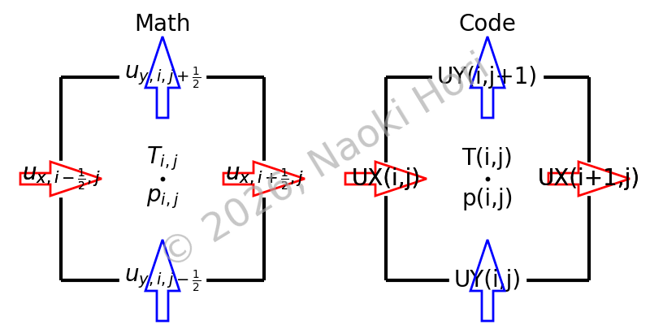
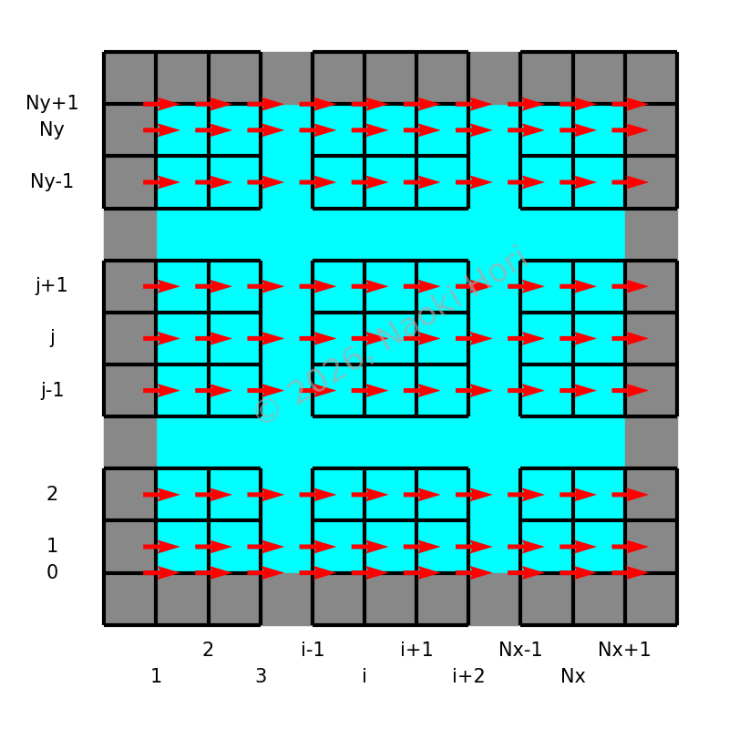
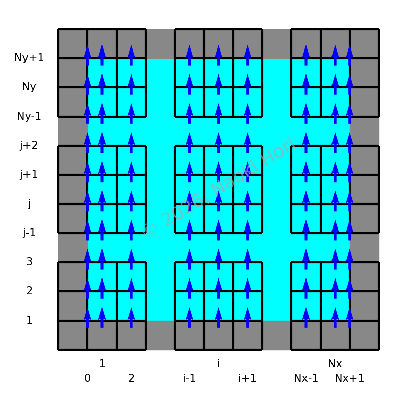
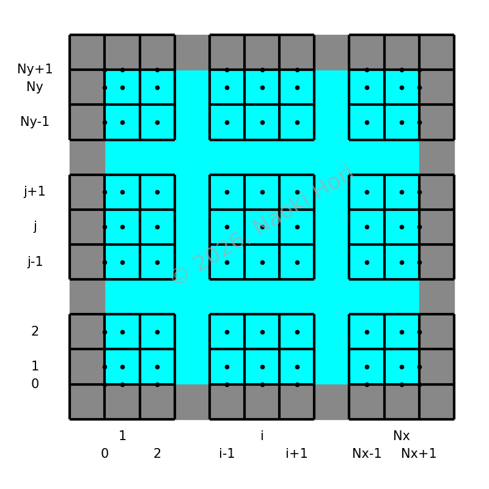

# Domain

Staggered velocity arrangement is adopted:

Wall-bounded two-dimensional domains are considered.

X velocity vectors are configured as follows:

Y velocity vectors are configured as follows:

Scalar fields (pressure, among others) are configured as follows:

