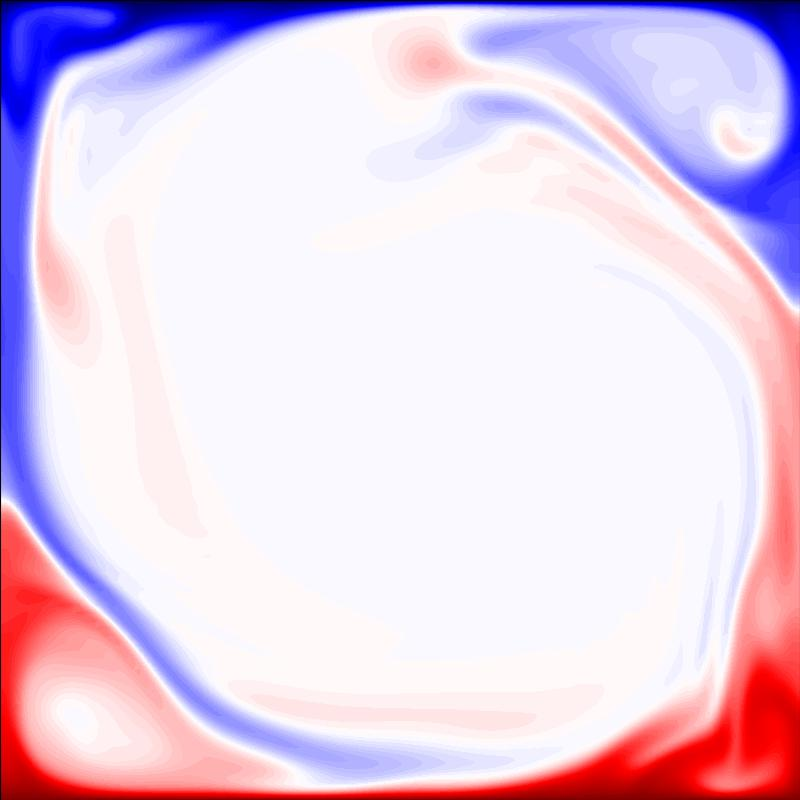

# Non-Uniform



CFD solver for wall-bounded turbulent flows.

## Quick Start

Build solver and run:

```console
make output
make all
./a.out
```

Domain (lengths, degree of freedoms, grid stretching, among others) is configured in `src/domain.c`.

## Features

- Active scalar coupling (temperature and salinity: double-diffusive convections)
- Three-step Runge-Kutta time integrator
- Implicit diffusive treatment (using factorization)

## Reference

- [Costa et al., arXiv, 2026](https://arxiv.org/abs/2603.09528)

