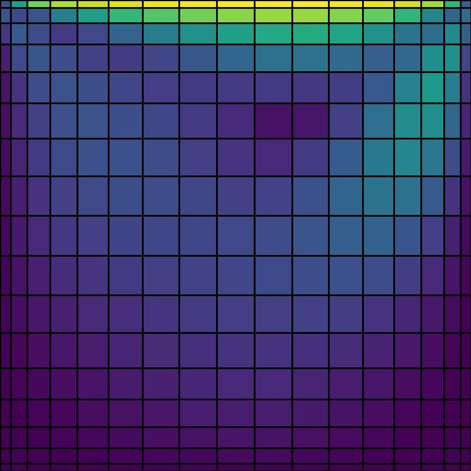

# Non-Uniform



CFD solver incorporating the general matrix-matrix multiplication technique, enabling the use of stretched (non-uniform) grids in multiple directions.

## Quick Start

Build solver and run:

```console
make output
make all
./a.out
```

Domain (lengths, degree of freedoms, grid stretching, among others) is configured in `src/domain.c`.

## Documentation

Visit [docs](./docs).
Important feature is briefly documented.

## Caveat

The objective is to understand how the Poisson equation is handled on non-uniform grid spacings.
Performance is out-of consideration.

For practical use, a better time-marching scheme (e.g., one of the Runge-Kutta families) should be used instead of the Euler-forward method.
Also, implicit treatment of the diffusive terms is needed to avoid extremely small time-step size.

## Reference

- [Costa et al., arXiv, 2026](https://arxiv.org/abs/2603.09528)

