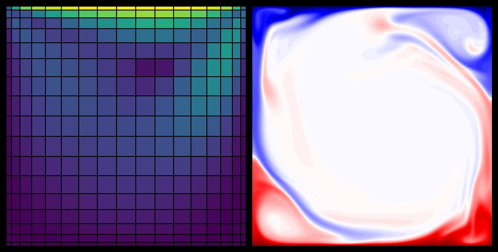

# Non-Uniform



CFD solver incorporating the general matrix-matrix multiplication technique, enabling the use of stretched (non-uniform) grids in multiple directions.

## Quick Start

Build solver and run:

```console
make output
make all
./a.out
```

Domain (lengths, degree of freedoms, grid stretching, among others) is configured in `src/domain.c`.

## Features

- Active scalar coupling (temperature and salinity: double-diffusive convections)
- Three-step Runge-Kutta time integrator
- Implicit diffusive treatment (using factorization)

## Documentation

Visit [docs](./docs).
Important feature is briefly documented.

## Non-dimensional equations

```math
\frac{\partial u_i}{\partial x_i}
=
0,
```

```math
\frac{\partial u_i}{\partial t}
=
-
u_j
\frac{\partial u_i}{\partial x_j}
-
\frac{\partial p}{\partial x_i}
+
\frac{\sqrt{Pr}}{\sqrt{Ra}}
\frac{\partial}{\partial x_j}
\frac{\partial u_i}{\partial x_j}
+
\left( T - N S \right) g_i \delta_{iy},
```

```math
\frac{\partial T}{\partial t}
=
-
u_i
\frac{\partial T}{\partial x_i}
+
\frac{1}{\sqrt{Pr}}
\frac{1}{\sqrt{Ra}}
\frac{\partial}{\partial x_i}
\frac{\partial T}{\partial x_i},
```

```math
\frac{\partial S}{\partial t}
=
-
u_i
\frac{\partial S}{\partial x_i}
+
\frac{1}{Le}
\frac{1}{\sqrt{Pr}}
\frac{1}{\sqrt{Ra}}
\frac{\partial}{\partial x_i}
\frac{\partial S}{\partial x_i}.
```

There are four non-dimensional numbers:

- Rayleigh number $Ra$
- Prandtl number $Pr$
- Lewis number $Le$
- Density ratio $N$

## Caveat

The objective is to understand how the Poisson equation is handled on non-uniform grid spacings.
Performance is out-of consideration.

## Reference

- [Costa et al., arXiv, 2026](https://arxiv.org/abs/2603.09528)

