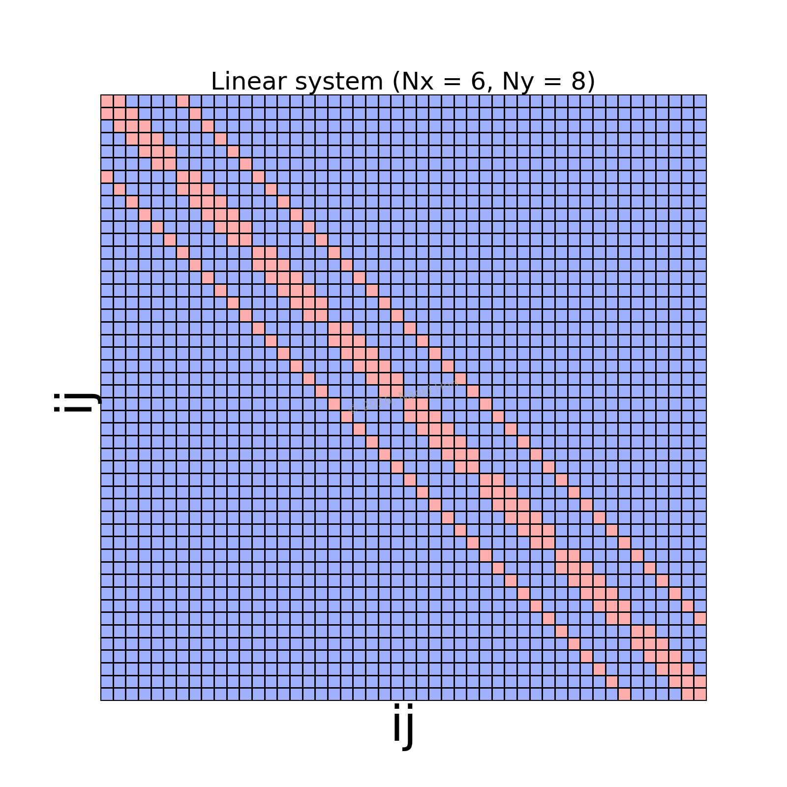
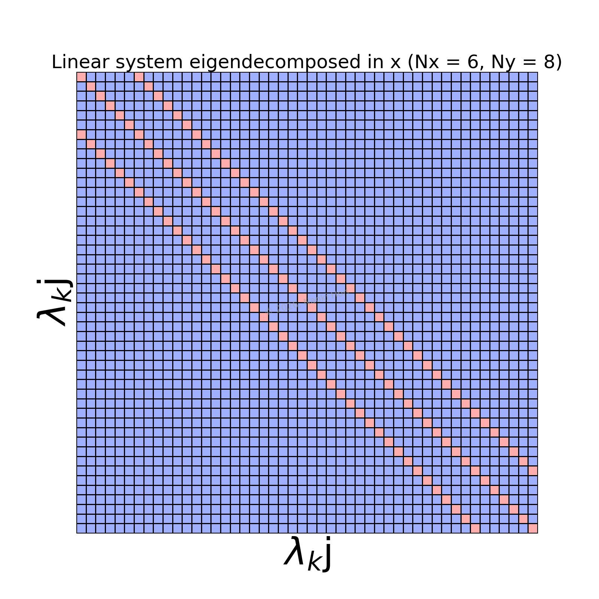

# Discrete Poisson equation

The two-dimensional Poisson equation discretized by the second-order accurate central-finite-difference schems in rectilinear coordinates leads to:

```math
{{\left( {l}_1 \right)_{i}} {{f}_{i-1, j}} - \left( {\left( {l}_1 \right)_{i}} + {\left( {u}_1 \right)_{i}} \right) {{f}_{i, j}} + {\left( {u}_1 \right)_{i}} {{f}_{i+1, j}} + {\left( {l}_2 \right)_{j}} {{f}_{i, j-1}} - \left( {\left( {l}_2 \right)_{j}} + {\left( {u}_2 \right)_{j}} \right) {{f}_{i, j}} + {\left( {u}_2 \right)_{j}} {{f}_{i, j+1}} = {{g}_{i, j}}},
```

where

```math
{{\left( {l}_1 \right)_{i}} = \frac{{1}}{{\left( {h}_{{\xi}^1} \right)_{i}}} \frac{{1}}{{\left( {h}_{{\xi}^1} \right)_{i-\frac{1}{2}}}}},
```

```math
{{\left( {u}_1 \right)_{i}} = \frac{{1}}{{\left( {h}_{{\xi}^1} \right)_{i}}} \frac{{1}}{{\left( {h}_{{\xi}^1} \right)_{i+\frac{1}{2}}}}},
```

```math
{{\left( {l}_2 \right)_{j}} = \frac{{1}}{{\left( {h}_{{\xi}^2} \right)_{j}}} \frac{{1}}{{\left( {h}_{{\xi}^2} \right)_{j-\frac{1}{2}}}}},
```

```math
{{\left( {u}_2 \right)_{j}} = \frac{{1}}{{\left( {h}_{{\xi}^2} \right)_{j}}} \frac{{1}}{{\left( {h}_{{\xi}^2} \right)_{j+\frac{1}{2}}}}}.
```

This is a sparse linear system which looks like:

<p align="center">
  
</p>

where the red and blue cells contain non-zero and zero values, respectively.

To solve this system directly, we first aim to convert the original system to

```math
{{\lambda_x} {{F}_{\lambda_k, j}} + {\left( {l}_2 \right)_{j}} {{F}_{\lambda_k, j-1}} - \left( {\left( {l}_2 \right)_{j}} + {\left( {u}_2 \right)_{j}} \right) {{F}_{\lambda_k, j}} + {\left( {u}_2 \right)_{j}} {{F}_{\lambda_k, j+1}} = {{G}_{\lambda_k, j}}},
```

which looks like:

<p align="center">
  
</p>

This conversion (eigendecomposition) is achieved by applying a block-diagonal operator ${B}$:

```math
{B}_{ij} {f}_{jk} {B}_{lk}
=
{B}_{ij} {g}_{jk} {B}_{lk},
```

where ${B}$ has $Q$ (which is elaborated in the next part) repeatedly (for $N_y$ times) on the main diagonal.

The converted system is tridiagonal for each ${\lambda_x}$ and thus can be solved fairly easily by e.g., the Thomas algorithm.

## Spectral decomposition

To find the transform from ${f}$ to ${F}$, we focus on the one-dimensional equation:

```math
{{\left( {l}_1 \right)_{i}} {{f}_{i-1}} - \left( {\left( {l}_1 \right)_{i}} + {\left( {u}_1 \right)_{i}} \right) {{f}_{i}} + {\left( {u}_1 \right)_{i}} {{f}_{i+1}} = {{g}_{i}}},
```

or equivalently:

```math
{{L_{ij}} {{f}_j} = {{g}_i}}.
```

Our objective is equivalent to decompose the linear operator ${L_{ij}}$.
To this end, we utilize that a real symmetric matrix can be decomposed as

```math
{{S_{ij}} = {Q_{ik}} {\Lambda_{kl}} {Q_{jl}}},
```

where ${Q_{ik}}$ and ${\Lambda_{kl}}$ are the orthogonal and diagonal matrices, respectively.

Note that ${L_{ij}}$ is not symmetric and thus the spectral decomposition is not directly applicable.
To symmetrize it, we use the following relation:

```math
{{S_{ij}} = {D_{ik}} {L_{kl}} {D^{-1}_{lj}}},
```

with ${D_{ij}}$ being a diagonal matrix whose components are:

```math
{{D_{ii}} = {\sqrt{{\left( {h}_{{\xi}^1} \right)_{i}}}}}.
```

As a consequence, the one-dimensional equation of interest leads to

```math
{{\Lambda_{ik}} {Q_{lk}} {D_{lj}} {{f}_j} = {Q_{ki}} {D_{kj}} {{g}_j}},
```

or equivalently

```math
{{\Lambda_{ij}} {{F}_j} = {{G}_i}},
```

where we use that inverse of an orthogonal matrix is equal to the transpose of it.

## Reference

- [Eigendecomposition of a matrix](https://en.wikipedia.org/wiki/Eigendecomposition_of_a_matrix)

